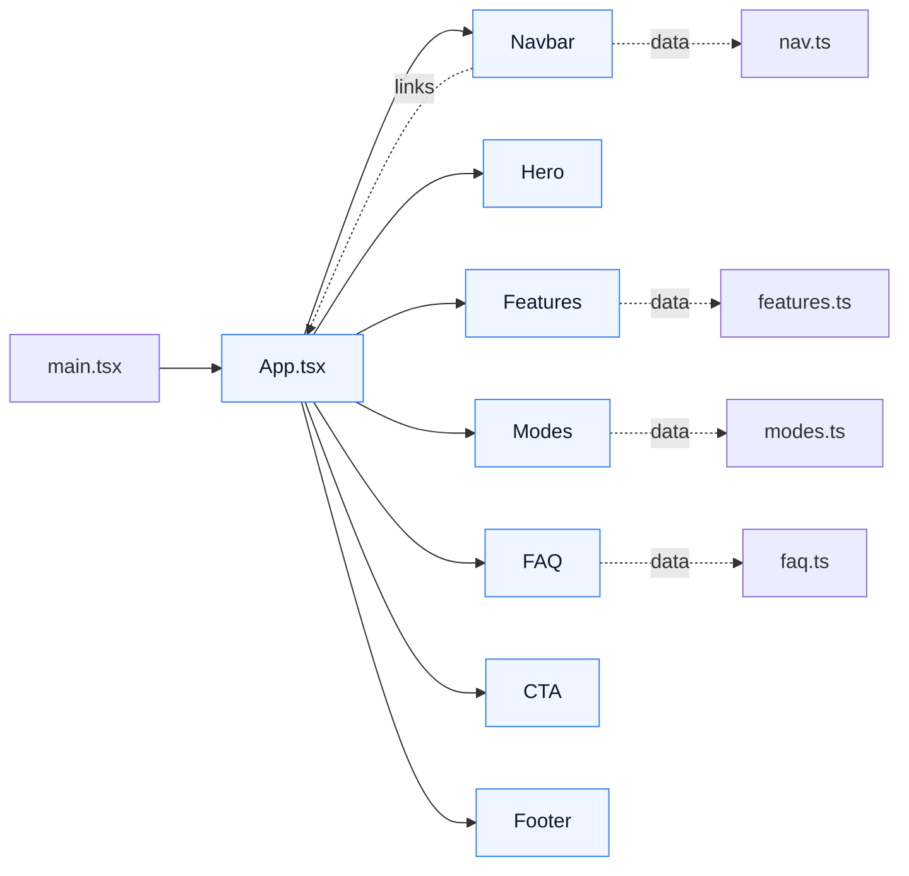
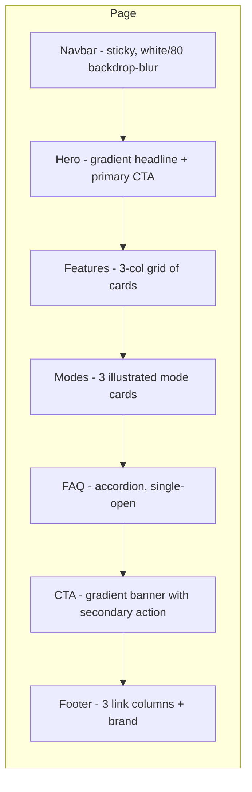
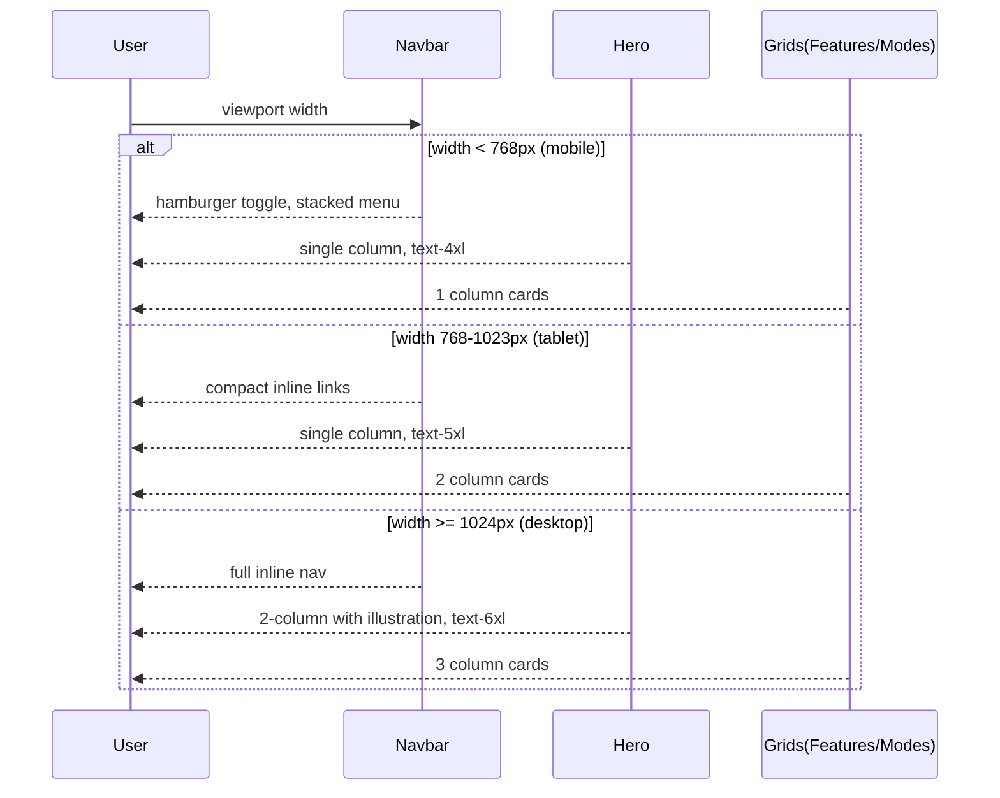

# ClawX Landing Page — React + TypeScript + Tailwind Design Plan
## Goal

Build the ClawX landing page in **React + TypeScript (TSX) + Tailwind CSS**, with each section as a separate reusable component. **Styling:** White background, blue-500 → blue-600 gradient accents, neutral  text, `rounded-md`/ buttons, `shadow-md`, keep padding, generous spacing, strong typography, subtle animations, minimal colors and decoration, fully responsive. **Components:** `Navbar`, `Hero`, `Features`,  `Modes`, `FAQ`, `CTA`, `Footer`. Make it tastefull.

## Research Summary

Workspace 'C:/Users/debas/OneDrive/Desktop/Web Development/PROJECT/ClawX' is the target project root. No existing source files were inspected yet — assuming a fresh React + Vite + TS scaffold (standard convention) where index.html, src/main.tsx, src/App.tsx, src/index.css, and tailwind.config.js exist. The plan creates a `src/components/` directory with seven section components, a shared section container helper, and a typed content/data module so sections remain reusable and prop-driven. Styling decisions are encoded once in tailwind.config (blue gradient stops, neutral text color, shadow/radius tokens) and applied via small utility class strings per component. Animations are subtle CSS-based (Tailwind animate-in utilities + a single `fade-up` keyframe) to keep bundle size and motion tasteful. Responsiveness follows Tailwind's mobile-first breakpoints (sm/md/lg). No backend or routing is required for a landing page, so React Router is intentionally omitted.

## Tech Stack
- **React 18** — Component model for the landing page
- **TypeScript** — Typed props for reusable section components
- **Vite** — Dev server / build for the TSX app
- **Tailwind CSS** — Utility styling, gradient/shadow/radius tokens, responsive breakpoints
- **PostCSS + Autoprefixer** — Tailwind processing pipeline (already part of Vite + Tailwind setup)

## Diagrams

### Component & data flow

### Section layout & visual hierarchy

### Responsive breakpoint behavior

## Assumptions
- Project is scaffolded with Vite + React + TypeScript and Tailwind CSS v3+ (or v4 with @tailwindcss/vite); src/, index.html, src/main.tsx, src/index.css exist.
- Tailwind is configured to scan .tsx files (content paths include './index.html' and './src/**/*.{ts,tsx}').
- No existing landing page components live in src/components; if any exist they will be replaced/extended rather than duplicated.
- Icons will be inline SVGs (no extra icon library) to keep the bundle minimal and the visual language consistent.
- The data for each section (features list, modes list, FAQ items, nav links) will live in src/data/*.ts so components stay presentational and reusable.
- 'Modes' refers to a product-mode showcase row (e.g. Chat / Code / Vision) — interpreted as 3 cards with icon + title + short description.
- Subtle animations mean: entrance fade-up on first paint, hover lift on cards/buttons only; no scroll-jacking or heavy parallax.

## Implementation Procedure

### Step 1. Scaffold review & Tailwind tokens [low]
Confirm src/main.tsx renders <App/>, src/index.css imports Tailwind directives, and tailwind.config.js extends theme with: blue-500→blue-600 gradient class shortcut (or use bg-gradient-to-r from-blue-500 to-blue-600 inline), neutral text colors (text-slate-700/900), shadow-md default for cards, rounded-md default for buttons/cards. Add a `fadeUp` keyframe in tailwind.config.js extend.keyframes + `fade-up` animation utility for entrance motion. No file is created if already correct; only add what's missing.

Likely files:
- `tailwind.config.js`
- `src/index.css`

Hints:
- Add safelist for any dynamically built class strings
- Keep gradient utility as inline classes to stay Tailwind-purge safe

### Step 2. Shared layout primitives [low]
Create `src/components/Section.tsx` exporting a reusable <Section id eyebrow title description children className?> wrapper that applies: max-w-7xl mx-auto px-4 sm:px-6 lg:px-8 py-16 md:py-24, optional eyebrow (uppercase text-xs tracking-wider text-blue-600), h2 title (text-3xl md:text-4xl font-semibold text-slate-900), and muted description (mt-3 text-slate-600 max-w-2xl). Also create `src/components/Container.tsx` as a thin max-width wrapper used by Navbar and Footer. These keep section components DRY and visually consistent.

Likely files:
- `src/components/Section.tsx`
- `src/components/Container.tsx`

Hints:
- Use semantic <section> with id for anchor nav
- Center align header block via mx-auto text-center on parent

### Step 3. Typed data module [low]
Add `src/data/content.ts` exporting typed arrays: `navLinks: {label,href}[]`, `features: {icon:'chat'|'bolt'|'shield',title,description}[]`, `modes: {icon,title,description,badge}[]`, `faqs: {question,answer}[]`. Use string-literal unions for icons so the rendering components can switch on them safely. Keeps components presentational and reusable for future pages.

Likely files:
- `src/data/content.ts`

Hints:
- Prefer `as const` arrays for narrow types
- Export a single object `siteContent` aggregating all four for one import site

### Step 4. Navbar component [medium]
Implement `src/components/Navbar.tsx`: sticky top, white/80 backdrop-blur, border-b border-slate-200. Left: brand wordmark 'ClawX' with a small blue-500→blue-600 gradient square. Right: inline links (md+) from navLinks, primary CTA button 'Get Started' (rounded-md bg-gradient-to-r from-blue-500 to-blue-600 text-white px-4 py-2 shadow-md hover:shadow-lg transition). Mobile (<md): hamburger toggles a stacked menu with same data. Use Container for width.

Likely files:
- `src/components/Navbar.tsx`

Hints:
- Use useState for mobile toggle
- Add `aria-expanded` and `aria-controls` for a11y

### Step 5. Hero component [medium]
Implement `src/components/Hero.tsx`: two-column on lg (text left, decorative right), single column on mobile. Big headline 'Meet ClawX — your AI co-pilot for everything.' with the last phrase highlighted via bg-clip-text text-transparent bg-gradient-to-r from-blue-500 to-blue-600. Subtitle in text-slate-600, primary CTA + secondary 'Learn more' link. Right column: a soft rounded-2xl card with shadow-md showing 3 placeholder UI chips (inline SVG icons). Add `animate-fade-up` to text and image.

Likely files:
- `src/components/Hero.tsx`

Hints:
- Use min-h-[80vh] with flex centering for impact
- Keep secondary CTA as a text link with arrow, not a button

### Step 6. Features component [medium]
Implement `src/components/Features.tsx`: wraps content in <Section> with eyebrow 'Features', title 'Everything you need, nothing you don't.', description. Below: responsive grid grid-cols-1 md:grid-cols-2 lg:grid-cols-3 gap-6. Each FeatureCard: rounded-xl bg-white border border-slate-200 p-6 shadow-md hover:shadow-lg hover:-translate-y-0.5 transition. Icon in a 10x10 rounded-md blue-50 box with blue-600 SVG. Title (text-lg font-semibold text-slate-900) + description (text-slate-600).

Likely files:
- `src/components/Features.tsx`

Hints:
- Map over data/features; switch on icon key for inline SVG
- Stagger animation delays via inline style for fade-up

### Step 7. Modes component [medium]
Implement `src/components/Modes.tsx`: Section with eyebrow 'Modes', title 'One assistant, many superpowers.', description. Render modes as 3 horizontal cards on lg (grid-cols-1 md:grid-cols-3 gap-6), each taller than feature cards: rounded-2xl, soft blue-50/white gradient background, p-8, shadow-md. Each card: large icon (text-blue-600), title, description, and a small badge (rounded-md bg-blue-100 text-blue-700 px-2 py-0.5 text-xs) showing the mode tag.

Likely files:
- `src/components/Modes.tsx`

Hints:
- Reuse inline SVG icon switch from Features
- Use subtle gradient-to-br from-white to-blue-50 for depth

### Step 8. FAQ component [medium]
Implement `src/components/FAQ.tsx`: Section with eyebrow 'FAQ', title 'Questions, answered.', description. Render a max-w-3xl mx-auto list of disclosure items from data/faqs. Each item: button (w-full flex justify-between items-center p-5 rounded-md bg-white border border-slate-200 shadow-sm hover:shadow-md transition) with question on left and chevron SVG that rotates when open. Panel below uses a single-open useState; smooth height transition via max-h + opacity. Use semantic <button aria-expanded> wrapping the row.

Likely files:
- `src/components/FAQ.tsx`

Hints:
- Keep one open at a time to feel focused
- Answer text uses text-slate-600 leading-relaxed

### Step 9. CTA component [low]
Implement `src/components/CTA.tsx`: full-width band with rounded-2xl bg-gradient-to-r from-blue-500 to-blue-600 text-white p-10 md:p-16 shadow-md. Inside Container: max-w-3xl text-center. Headline text-3xl md:text-4xl font-semibold, subtext text-blue-50, white button 'Start free' with rounded-md bg-white text-blue-600 font-medium px-6 py-3 shadow-md hover:shadow-lg transition. Add subtle fade-up animation.

Likely files:
- `src/components/CTA.tsx`

Hints:
- Use mx-auto on the band via Container
- Keep contrast strong: text-blue-50 for subtitle, not white

### Step 10. Footer component [low]
Implement `src/components/Footer.tsx`: bg-slate-50 border-t border-slate-200. Inside Container: grid grid-cols-2 md:grid-cols-4 gap-8 py-12. Col 1: brand wordmark + short tagline in text-slate-600. Cols 2-4: link headings (Product / Resources / Company) with muted text-slate-600 hover:text-blue-600 lists. Bottom row: text-xs text-slate-500 '© {year} ClawX. All rights reserved.'

Likely files:
- `src/components/Footer.tsx`
- `src/data/content.ts`

Hints:
- Define footer link groups next to navLinks in content.ts
- Use current year via new Date().getFullYear()

### Step 11. Assemble App [low]
Update `src/App.tsx` to import and render the seven components in order: Navbar → Hero → Features → Modes → FAQ → CTA → Footer, each wrapped in a semantic fragment. Ensure smooth anchor scrolling by setting `html { scroll-behavior: smooth }` in src/index.css (or a small inline style) so nav anchor links work. Confirm `index.html` has a meta viewport and a clean <title>ClawX</title>.

Likely files:
- `src/App.tsx`
- `src/index.css`
- `index.html`

Hints:
- Use #features, #modes, #faq ids matching navbar hrefs
- Keep App.tsx thin — no business logic

### Step 12. Responsive & polish pass [medium]
Verify every component passes mobile-first checks: Navbar collapses <md, Hero stacks, grids fall back to 1 column <md then 2 <lg, FAQ items full width, CTA padding shrinks. Confirm typography scale: text-4xl md:text-5xl lg:text-6xl on Hero, text-3xl md:text-4xl on section titles. Add `prefers-reduced-motion` guard that disables fade-up animations for users who opt out (one media query in src/index.css).

Likely files:
- `src/index.css`
- `src/components/*.tsx`

Hints:
- Reuse existing tokens; avoid one-off utility strings
- Spot-check at 375px, 768px, 1280px widths

## Risks
- If Tailwind v4 is in use, keyframes/animations must be defined via @theme in CSS rather than tailwind.config.js — verify setup before step 1.
- Inline dynamically composed class strings (e.g. icon-based) can be purged by Tailwind; mitigate with a static map of full class names rather than concatenated strings.
- Smooth-scroll on anchor jumps can be visually jarring on long pages; keep it but ensure no hidden anchor target offset issues (no fixed header offset compensation may be needed if Navbar is sticky).
- Reduced-motion accessibility is easy to forget; included as explicit polish step.

## Success Criteria
- All seven components (Navbar, Hero, Features, Modes, FAQ, CTA, Footer) render in order inside App.tsx and are individually importable/reusable.
- Page is fully responsive at 375px, 768px, and 1280px with no horizontal overflow and readable typography at every breakpoint.
- Visual style adheres to brief: white background dominant, blue-500→blue-600 gradient limited to accents/headlines, neutral slate text, rounded-md buttons, shadow-md cards, generous py-16/py-24 spacing, minimal decoration.
- Subtle animations only: fade-up on entrance and hover lift on cards/buttons; disabled under prefers-reduced-motion.
- No new runtime dependencies added; project still builds with the existing Vite + Tailwind pipeline.
- FAQ behaves as a single-open accordion and Navbar mobile menu toggles correctly with proper aria attributes.
